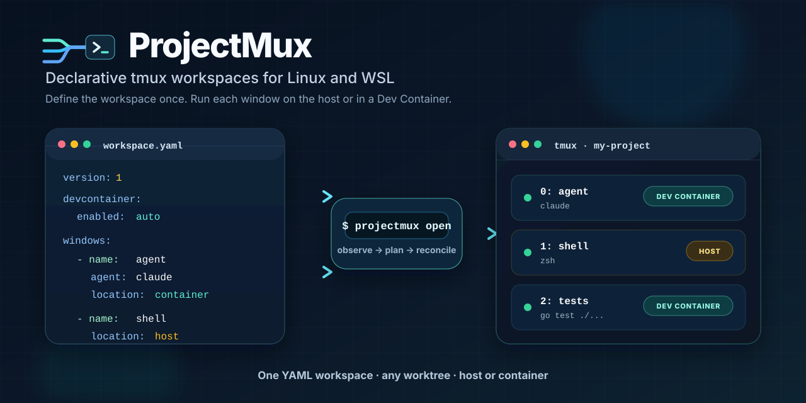

# ProjectMux — declarative tmux workspaces

<p align="center">
  <a href="https://github.com/gambtho/projectmux/releases"></a>
  <a href="https://github.com/gambtho/projectmux/actions/workflows/ci.yml"></a>
  <a href="LICENSE"></a>
</p>

<p align="center">
  
</p>

ProjectMux is a declarative tmux workspace manager for Linux and WSL. Define a
project's windows in YAML — shells, commands, and CLI coding agents — and choose
whether each one runs on the host or inside the repository's Dev Container.

You describe a workspace once: its windows, what each one runs, where it runs,
and which one gets focus. ProjectMux observes what tmux and the container
runtime are actually doing, then makes the machine match that description.

## Why ProjectMux

- **One workspace definition.** Layer shared defaults, per-repository
  configuration, and machine-local overrides without repeating every window.
- **Host and container windows.** Each tmux window runs on the host or inside
  the repository's Dev Container, decided per window.
- **Reconciliation, not a startup script.** ProjectMux observes what exists,
  explains the drift, and converges toward the declared workspace instead of
  blindly recreating it.
- **Worktree-aware lookup.** Open a repository by name from configured roots,
  including linked git worktrees in the conventional directories.
- **Readable by humans and machines.** Concise terminal reports, or a versioned
  JSON envelope with documented exit codes.
- **No replacement ecosystem.** Your tmux configuration, container runtime,
  editor, shell, and `devcontainer.json` stay exactly as they are.

## Quick start

Install:

```sh
go install github.com/gambtho/projectmux/cmd/projectmux@latest
```

Create a minimal set of defaults:

```sh
mkdir -p ~/.config/projectmux

cat > ~/.config/projectmux/defaults.yaml <<'YAML'
version: 1

repository_roots:
  - /home/you/workspace

devcontainer:
  enabled: auto

windows:
  - name: shell
    shell: true
    focus: true
YAML
```

Every window opens with a second shell pane beside it by default — same
directory, same container if the window runs in one. Add `panes: []` to a
window to keep it single-pane, or declare your own `panes` list.

Then open any repository under a configured root:

```sh
cd ~/workspace/my-project
projectmux config --validate
projectmux open
```

You attach, detach, and navigate with tmux exactly as you normally would.

> [!IMPORTANT]
> ProjectMux is alpha. Every documented command works, but the configuration
> schema and the command surface may change before 1.0, and there is no
> migration support for `v0.x` configuration. The versioned JSON envelope and
> the documented exit codes are the compatibility contracts.

## Project status

**The command surface is complete; the contracts are not yet stable.**
ProjectMux opens, attaches to, stops, and reports on workspaces, starts
containers at boot, and diagnoses its own installation. Every command listed
below works.

Expect breaking changes to the configuration schema and the command surface
while the version remains below 1.0. There is no migration support, and `v0.x`
builds are published as prereleases.

Two things are compatibility contracts even during the alpha:

- The **JSON output** of the reporting commands, which carries a
  `schema_version` field.
- The **exit codes** listed below.

Human-readable output is deliberately *not* a contract. Parse `--json` instead.

## Platform support

Linux and WSL2 are the supported platforms for v1. macOS and native Windows are
not supported and are not currently being tested.

ProjectMux requires `git` and `tmux` on `PATH`. Container-backed windows
additionally require a Docker-compatible runtime and the Dev Containers CLI;
workspaces that keep every window on the host need neither.

`projectmux doctor` reports which of these it can find, and their versions.

## Install

### From a release

Releases publish static `linux/amd64` and `linux/arm64` binaries with a
`SHA256SUMS` file. Download both, verify, then install:

```sh
VERSION=v0.4.0
ARCH=amd64   # or arm64
BASE=https://github.com/gambtho/projectmux/releases/download/$VERSION

curl -fsSLO $BASE/projectmux-linux-$ARCH
curl -fsSLO $BASE/SHA256SUMS

sha256sum --check --ignore-missing SHA256SUMS

mkdir -p ~/.local/bin
install -m 0755 projectmux-linux-$ARCH ~/.local/bin/projectmux
```

`--ignore-missing` lets you verify the one binary you downloaded against the
file covering both. Verification is the point of publishing checksums — if
`sha256sum` does not print `OK`, do not install the binary.

While the version is below 1.0, releases are marked as prereleases.

### With `go install`

```sh
go install github.com/gambtho/projectmux/cmd/projectmux@latest
```

The binary reports its version correctly when installed this way; see
[`version`](docs/commands.md#projectmux-version).

### From source

```sh
git clone https://github.com/gambtho/projectmux
cd projectmux
CGO_ENABLED=0 go build -o projectmux ./cmd/projectmux
```

Go 1.25 or newer is required. The binary is statically linked and has no runtime
dependency on cgo.

Run the tests, the vet pass, the linter, and a formatting check the same way CI
does:

```sh
test -z "$(gofmt -l .)"
go vet ./...
go run github.com/golangci/golangci-lint/v2/cmd/golangci-lint@v2.12.2 run ./...
go test -race ./...
```

The configuration and resolver tests are hermetic: they create throwaway git
repositories in temporary directories and require no live tmux session, Docker
daemon, or Dev Containers CLI.

## Configuration

Configuration lives under `$XDG_CONFIG_HOME/projectmux` (falling back to
`~/.config/projectmux` when `XDG_CONFIG_HOME` is unset), and state under
`$XDG_STATE_HOME/projectmux` (falling back to `~/.local/state/projectmux`).

Three environment variables override where ProjectMux looks. Each is intended
for tests, and for running a second ProjectMux beside a working one without
disturbing it:

| Variable | Overrides |
| --- | --- |
| `PROJECTMUX_CONFIG_ROOT` | the configuration directory |
| `PROJECTMUX_STATE_ROOT` | the state directory holding `state.db` |
| `PROJECTMUX_TMUX_SOCKET` | the tmux server, passed to tmux as `-L <name>` |

Set together, they give a fully separate installation: it cannot see or change
the sessions or records of the default one. Because tmux cannot move a client
between servers, `open` and `attach` refuse with exit code 6 when your terminal
is attached to a different server than `PROJECTMUX_TMUX_SOCKET` names — detach
first, or use `open --no-attach`.

Three layers are read, in order, and later layers override earlier ones:

| Layer | Path | Purpose |
| --- | --- | --- |
| Defaults | `defaults.yaml` | settings shared by every workspace |
| Workspace | `workspaces/<slug>.yaml` | settings for one repository |
| Local | `workspaces/<slug>.local.yaml` | machine-specific overrides, not usually committed |

Every layer is optional. A missing file, an empty file, and a comment-only file
are all treated as an empty document.

`<slug>` is the repository name. A linked git worktree inherits its parent
repository's slug, so every worktree of a project shares one configuration.

Windows merge by `name`, not by position. An overriding layer that names an
existing window edits that window in place and leaves the base ordering alone;
a window whose name is new is appended. `repository_roots` may only be set in
`defaults.yaml`, because it is what makes lookup by workspace name possible in
the first place.

Configuration is validated strictly and fails *before* anything is mutated.
Unknown fields, invalid enum values, durations without units, unsupported schema
versions, duplicate window names, more than one focused window, and a window
that does not name exactly one of `agent`, `command`, or `shell` are all errors.

### Example

```yaml
version: 1

# Only meaningful in defaults.yaml. Directories searched when you name a
# workspace instead of running inside it.
repository_roots:
  - /home/you/workspace

devcontainer:
  enabled: auto        # auto | true | false
  start_timeout: 5m

environment:
  CGO_ENABLED: "1"

windows:
  - name: agent-1
    agent: claude
    focus: true
  - name: shell
    shell: true
  - name: build
    command: make test
    cwd: sub/dir       # relative to the worktree; may not escape it
    location: container
```

`location` is left unresolved when you omit it. It is decided later against the
workspace's actual container binding rather than being defaulted to `container`
or `host` at load time.

## Usage

```sh
cd ~/workspace/my-project
projectmux open          # create the session if needed, then attach
projectmux status        # what is running, and what would change
projectmux stop          # end the session
```

`projectmux <workspace>` with no command is shorthand for `open`, so
`projectmux my-project` opens that workspace from anywhere.

### Commands

| Command | What it does |
| --- | --- |
| [`open`](docs/commands.md#projectmux-open) | observe, ensure, record, and attach the workspace session |
| [`attach`](docs/commands.md#projectmux-attach) | attach to a live session; never creates one |
| [`stop`](docs/commands.md#projectmux-stop) | end the session, and with `--container` its container |
| [`autostart`](docs/commands.md#projectmux-autostart) | start containers for registered primary worktrees at boot |
| [`config`](docs/commands.md#projectmux-config) | print the merged configuration, or `--validate` it |
| [`list`](docs/commands.md#projectmux-list) | recorded workspaces and live identity-carrying sessions |
| [`status`](docs/commands.md#projectmux-status) | observe one workspace and explain drift |
| [`doctor`](docs/commands.md#projectmux-doctor) | diagnose dependencies, config, state, and drift |
| [`rebuild`](docs/commands.md#projectmux-rebuild) | recover lost registrations from the identity keys live sessions carry |
| [`version`](docs/commands.md#projectmux-version) | print the version |

Every command that produces a report accepts `--json` for a versioned envelope
and `--compact` for that envelope on one line.

**[Full command reference →](docs/commands.md)** — flags, arguments, real
output, and the exit code each command returns.

Commands that accept `<workspace>` resolve it from the current directory when
you omit it, or look it up by name under the configured `repository_roots`,
including linked worktrees in the conventional `.worktrees/` and
`.claude/worktrees/` directories.

### Exit codes

| Code | Meaning |
| --- | --- |
| 0 | success |
| 1 | unexpected or I/O failure |
| 2 | usage error |
| 3 | the workspace name matched more than one worktree |
| 4 | the workspace name matched no worktree |
| 5 | invalid configuration |
| 6 | the plan refused: a conflict or uncertainty; do not blindly retry |

## Relationship to tmux and Dev Containers

ProjectMux is a layer above both, and it owns neither.

**tmux** is the terminal multiplexer ProjectMux drives. ProjectMux does not
replace it, wrap its key bindings, or manage your `tmux.conf`; it creates and
reconciles sessions and windows and otherwise leaves tmux to you. You attach,
detach, and navigate with tmux exactly as you normally would.

**Dev Containers** provide the optional container a window can run in.
ProjectMux reads the standard `devcontainer.json` your editor already uses and
delegates to the Dev Containers CLI rather than defining a competing container
format:

- `devcontainer.enabled: auto` uses a container when the repository has a Dev
  Container configuration.
- `devcontainer.enabled: true` requires one and fails if it is missing.
- `devcontainer.enabled: false` keeps every window on the host.

The design goal is that a workspace remains usable without ProjectMux. Removing
it should leave a working repository, a working tmux, and a working Dev
Container.

## Questions

### Does ProjectMux replace tmux?

No. It is a workspace controller built on tmux. Your existing key bindings,
plugins, and `tmux.conf` keep working, and ProjectMux never edits them.

### Does ProjectMux require Docker?

Only for container-backed windows. A workspace whose windows all run on the
host needs just `git` and `tmux` — no container runtime and no Dev Containers
CLI are involved.

### Can it run CLI coding agents?

Yes. An `agent` window launches the configured command — `claude`, `codex`, or
anything else on `PATH` — in an ordinary tmux window, on the host or in the Dev
Container. ProjectMux manages the workspace lifecycle only: it does not assign
tasks, coordinate models, or interpret agent output, and it is not an
agent-orchestration platform.

### Does it support git worktrees?

Yes. Workspace lookup resolves linked worktrees, including those in the
conventional `.worktrees/` and `.claude/worktrees/` directories, and workspace
identity is collision-safe across them. A linked worktree shares its parent
repository's configuration.

### Does it create or manage worktrees?

No. Managing project source and creating worktrees are explicit non-goals.
ProjectMux opens worktrees that already exist; `git` and your existing tools
remain responsible for creating them.

### Which operating systems are supported?

Linux and WSL2. macOS and native Windows are not supported and are not
currently tested.

## Documentation

- [Command reference](docs/commands.md) — every command, its flags, its output,
  and its exit codes.
- [Design](docs/design.md) — the full design document: architecture, identity
  and state, reconciliation, and the decisions behind them.

## License

MIT. See [LICENSE](LICENSE).
